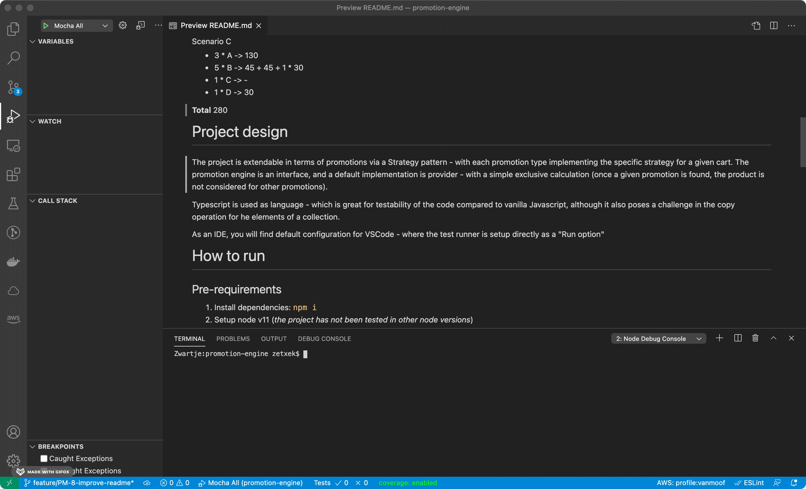

# promotion-engine
Typescript practice with some design patterns and a code challenge 👨‍💻

# Problem description

We need you to implement a simple promotion engine for a checkout process. Our Cart contains a list of single character SKU ids (A, B, C.	) over which the promotion engine will need to run.

The promotion engine will need to calculate the total order value after applying the 2 promotion types
- buy 'n' items of a SKU for a fixed price (3 A's for 130)
- buy SKU 1 & SKU 2 for a fixed price ( C + D = 30 )

The promotion engine should be modular to allow for more promotion types to be added at a later date (e.g. a future promotion could be x% of a SKU unit price). For this coding exercise you can assume that the promotions will be mutually exclusive; in other words if one is applied the other promotions will not apply

## Test Setup
### Unit price for SKU IDs 
- A	50
- B	30
- C	20
- D	15

### Active Promotions

- 3 of A's for 130
- 2 of B's for 45 C & D for 30

#### Scenario A
- 1 * A -> 50
- 1 * B -> 30
- 1 * C -> 20

**Total**
100


#### Scenario B
- 5 * A -> 130 + 2*50
- 5 * B -> 45 + 45 + 30
- 1 * C -> 28

**Total**
370

#### Scenario C
- 3 * A -> 130
- 5 * B -> 45 + 45 + 1 * 30
- 1 * C -> -
- 1 * D -> 30

**Total**
280


# Project design

[](https://codeclimate.com/github/zetxek/promotion-engine/maintainability)
[](https://codeclimate.com/github/zetxek/promotion-engine/test_coverage)

The project is extendable in terms of promotions via a Strategy pattern - with each promotion type implementing the specific strategy for a given cart.

The promotion engine is an interface, and a default implementation is provider - with a simple exclusive calculation (once a given promotion is found, the product is not considered for other promotions).

Additional elements could also be further decoupled from the specific implementation (Product, Cart...).

Typescript is used as language - which is great for testability of the code compared to vanilla Javascript, although it also poses a challenge in the copy operation for he elements of a collection.

As an IDE, you will find default configuration for VSCode - where the test runner is setup directly as a "Run option"



# How to run

## Pre-requirements

1. Install dependencies: `npm i`
2. Setup node v11 (_the project has not been tested in other node versions_)
## Run test cases

To start the test suite you can execute the following command:
```
npm run test
```

Sample output:
```
npm run test

> promotion-engine@1.0.0 test /Users/zetxek/Documents/Projects/promotion-engine
> mocha -r ts-node/register --recursive "src/**/*.spec.ts"


  HelloWorld
    Say hi, ()
      ✓ should say Hello, adrian
      ✓ should say Hello, world

  Cart
    Creates an empty cart
      ✓ should create an empty cart
    Creates a cart and adds products
      ✓ should add an item
      ✓ should add an item, allow add/remove operations
      ✓ should handle item removal then amount = 0

  PromotionEngine
    Validating sample carts
      ✓ (no promotions) 1A, 1B, 1C = 100
      ✓ 5A, 5B, 1C = 370
      ✓ 3A, 5B, 1C, 1D = 370

  Product
    Product A,50  ()
      ✓ should create a Product A with price 50
      ✓ should create a Product B with price 50 and change to 30

  AmountPromotion
    AmountPromotion(A,3,130)
      ✓ should get a discount of 20
    AmountPromotion(B,2,45)
      ✓ should get a discount of 15
      ✓ should get a discount of 30

  BundlePromotion
    BundlePromotion
      ✓ should get a discount of 15


  15 passing (1s)
  ```

  ## Roadmap/improvements

  There are a series of items to improve, a showcase of some:
  - [CI/CD (via Github actions, for example)](https://github.com/zetxek/promotion-engine/issues/9)
  - [Code coverage reports](https://github.com/zetxek/promotion-engine/issues/10)
  - [Dependency cleanup](https://github.com/zetxek/promotion-engine/issues/11)
  - [Review node compatibility](https://github.com/zetxek/promotion-engine/issues/12)

  For a complete, up-to-date list, check [the issues queue](https://github.com/zetxek/promotion-engine/issues).